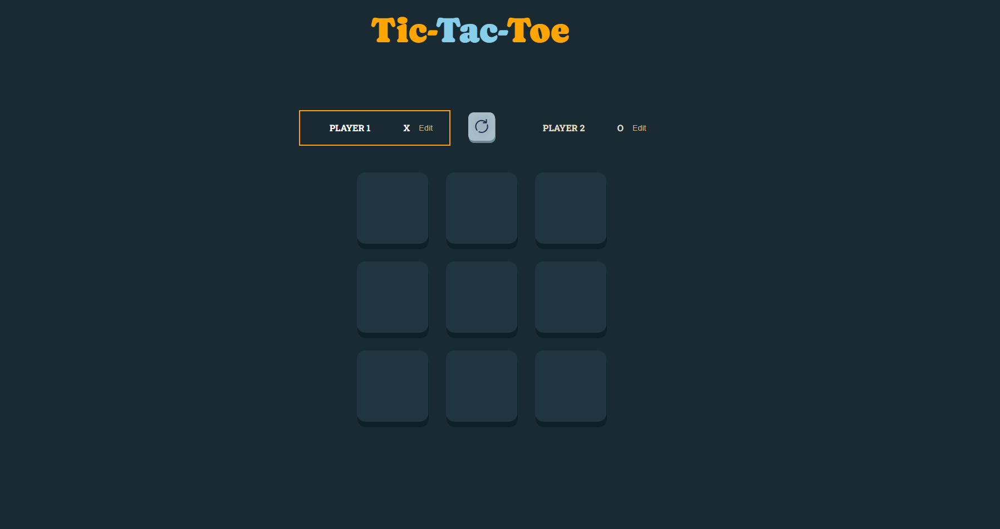

# 🎮 Tic-Tac-Toe con React

Proyecto desarrollado como práctica de fundamentos de React. Es una versión interactiva del clásico juego “Tres en Raya” donde dos jugadores pueden turnarse para marcar X y O en un tablero de 3x3.

---

## 🚀 Objetivo del proyecto
El propósito de este proyecto fue practicar con **React**, enfocándome en:

- El manejo de estados y props.  
- La creación de componentes reutilizables.  
- La implementación de la lógica del juego (turnos, ganador, empate).  
- El diseño de una interfaz simple y responsive.  

---

## 🛠️ Tecnologías utilizadas
- ⚛️ [React](https://react.dev/) – Librería de JavaScript para interfaces de usuario.  
- 🎨 [CSS](https://tailwindcss.com/) – Para los estilos y diseño responsive. 
---

## 📚 Lo que aprendí
- Manejo de **useState** para controlar la UI y el estado del tablero.  
- Paso de datos entre componentes mediante **props**.  
- Composición de componentes reutilizables.  
- Organización de la lógica de un juego paso a paso en React.  

---

## 🧩 Retos encontrados
- Implementar la detección automática de **ganador o empate**.  
- Reiniciar correctamente el estado del juego.  
- Mantener la lógica clara y separada de la interfaz.  

---

## 🔗 Demo
El proyecto está desplegado en **Netlify**:  
👉 [Ver demo en línea](ttt-videogame.netlify.app)

---

## 🖼️ Screenshots
Aquí una vista previa del proyecto:  

  

---

## 📌 Próximos pasos
- Implementar un modo contra la computadora (**IA básica**).  
- Agregar **animaciones** para las transiciones entre turnos.  
- Guardar y mostrar **puntuaciones** entre partidas.  

---
